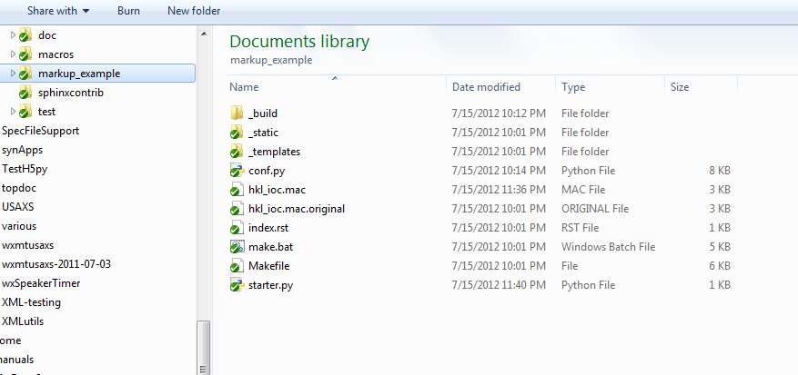
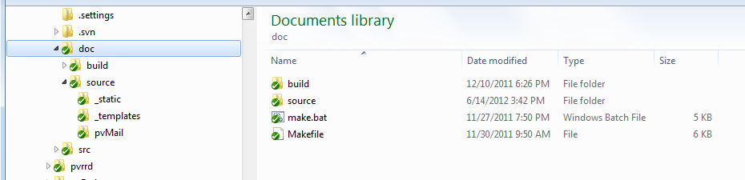
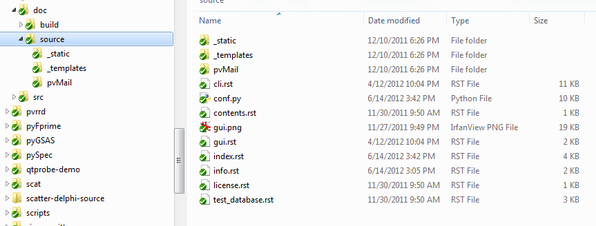

.. $Id$

====================================================================
How to Create and Configure a Sphinx project to Document SPEC Macros
====================================================================

.. tip:: for more information on this topic, refer to the SPhinx tutorial:
			http://sphinx.pocoo.org/tutorial.html

Decide which configuration
=================================

**In-source** configuration or
**Out-of-source** configuration?

.. tip:: Most likely, you will want to keep the Sphinx documentation 
			files in a separate directory from the SPEC macros.  
			Then again, maybe not.

.. index:: ! in-source configuration
.. _in-source configuration:

In-source configuration
---------------------------------

An *in-source* configuration is where the Sphinx ``.rst`` 
files are in **the same directory** as the SPEC macro files.

Here is a graphical example:

    Example directory of an in-source configuration

.. index:: ! out-of-source configuration

Out-of-source configuration
---------------------------------

An *out-of-source* configuration is where the Sphinx ``.rst`` 
files are in **a separate directory** from the SPEC macro files.

Here is a graphical example: [#]_

    Example build directory of an out-of-source configuration

The source files are located in the *source* directory (child of the build directory):

    Example *source* directory of an out-of-source configuration

.. caution::  FIXME: these are Python files and project directories.
	The figure *should* be shown with SPEC macro files out-of-source.

Create the Sphinx documentation tree
=====================================

.. sidebar:: Testing the installation

	These instructions are written to help you test 
	if you have installed *specdomain* correctly.
	They use an *in-source* configuration.

Make a new sandbox directory to try this out::

	mkdir /tmp/sandbox
	cd /tmp/sandbox

.. index:: sphinx-quickstart

Create a Sphinx configuration in this directory by running::

	sphinx-quickstart

Here's the full session:

.. code-block:: text
    :linenos:
    
	jemian@como-ubuntu64:/tmp/sandbox$ sphinx-quickstart 
	Welcome to the Sphinx 1.1.2 quickstart utility.
	
	Please enter values for the following settings (just press Enter to
	accept a default value, if one is given in brackets).
	
	Enter the root path for documentation.
	> Root path for the documentation [.]: 
	
	You have two options for placing the build directory for Sphinx output.
	Either, you use a directory "_build" within the root path, or you separate
	"source" and "build" directories within the root path.
	> Separate source and build directories (y/N) [n]: 
	
	Inside the root directory, two more directories will be created; "_templates"
	for custom HTML templates and "_static" for custom stylesheets and other static
	files. You can enter another prefix (such as ".") to replace the underscore.
	> Name prefix for templates and static dir [_]: 
	
	The project name will occur in several places in the built documentation.
	> Project name: sandbox
	> Author name(s): sandy
	
	Sphinx has the notion of a "version" and a "release" for the
	software. Each version can have multiple releases. For example, for
	Python the version is something like 2.5 or 3.0, while the release is
	something like 2.5.1 or 3.0a1.  If you don't need this dual structure,
	just set both to the same value.
	> Project version: test
	> Project release [test]: 
	
	The file name suffix for source files. Commonly, this is either ".txt"
	or ".rst".  Only files with this suffix are considered documents.
	> Source file suffix [.rst]: 
	
	One document is special in that it is considered the top node of the
	"contents tree", that is, it is the root of the hierarchical structure
	of the documents. Normally, this is "index", but if your "index"
	document is a custom template, you can also set this to another filename.
	> Name of your master document (without suffix) [index]: 
	
	Sphinx can also add configuration for epub output:
	> Do you want to use the epub builder (y/N) [n]: 
	
	Please indicate if you want to use one of the following Sphinx extensions:
	> autodoc: automatically insert docstrings from modules (y/N) [n]: y
	> doctest: automatically test code snippets in doctest blocks (y/N) [n]: 
	> intersphinx: link between Sphinx documentation of different projects (y/N) [n]: 
	> todo: write "todo" entries that can be shown or hidden on build (y/N) [n]: 
	> coverage: checks for documentation coverage (y/N) [n]: 
	> pngmath: include math, rendered as PNG images (y/N) [n]: 
	> mathjax: include math, rendered in the browser by MathJax (y/N) [n]: 
	> ifconfig: conditional inclusion of content based on config values (y/N) [n]: 
	> viewcode: include links to the source code of documented Python objects (y/N) [n]: y
	
	A Makefile and a Windows command file can be generated for you so that you
	only have to run e.g. `make html' instead of invoking sphinx-build
	directly.
	> Create Makefile? (Y/n) [y]: 
	> Create Windows command file? (Y/n) [y]: 
	
	Creating file ./conf.py.
	Creating file ./index.rst.
	Creating file ./Makefile.
	Creating file ./make.bat.
	
	Finished: An initial directory structure has been created.
	
	You should now populate your master file ./index.rst and create other documentation
	source files. Use the Makefile to build the docs, like so:
	   make builder
	where "builder" is one of the supported builders, e.g. html, latex or linkcheck.
	
	jemian@como-ubuntu64:/tmp/sandbox$  

In case you missed them, these are the non-default answers supplied:

=========================================================================================  ===============
prompt                                                                                     response
=========================================================================================  ===============
``> Project name:``                                                                        *sandbox*
``> Author name(s):``                                                                      *sandy*
``> Project version:``                                                                     *test*
``> autodoc: automatically insert docstrings from modules (y/N) [n]:``                     *y*
``> viewcode: include links to the source code of documented Python objects (y/N) [n]:``   *y*
=========================================================================================  ===============

Configure: Changes to ``conf.py``
=====================================

Edit the new file *conf.py* and add these two lines to the extensions list after line 28::

	# this says ${PYTHONPATH)/sphinxcontrib/specdomain.py must be found
	extensions.append('sphinxcontrib.specdomain')

If you wish, you can also change the *html_theme* from the 
*default* to *sphinxdoc* or *agogo* or one of the others.
Check the Sphinx documentation for the choices.  To change
the theme, look on line 97 (or thereabouts) and change::

	html_theme = 'default'

to::

	html_theme = 'sphinxdoc'

----------------------------------

.. rubric:: Footnotes

.. [#] The green check boxes correspond to the status of each item in the version control system.