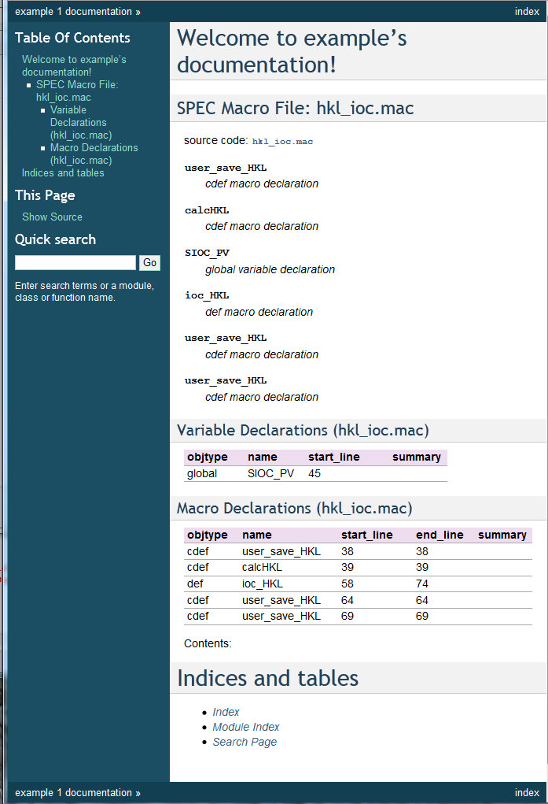
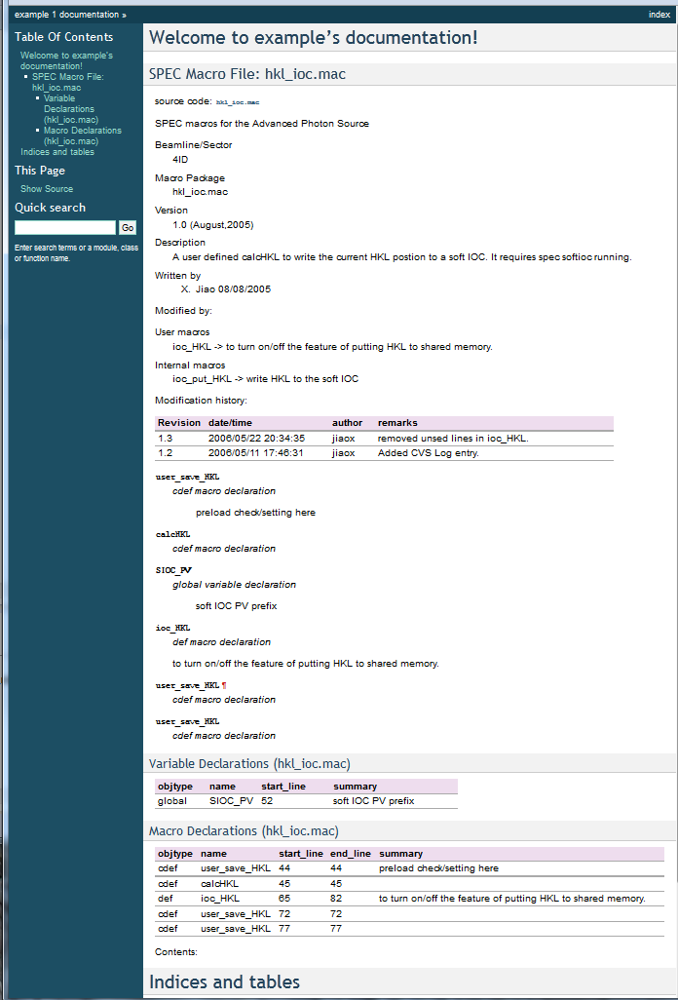
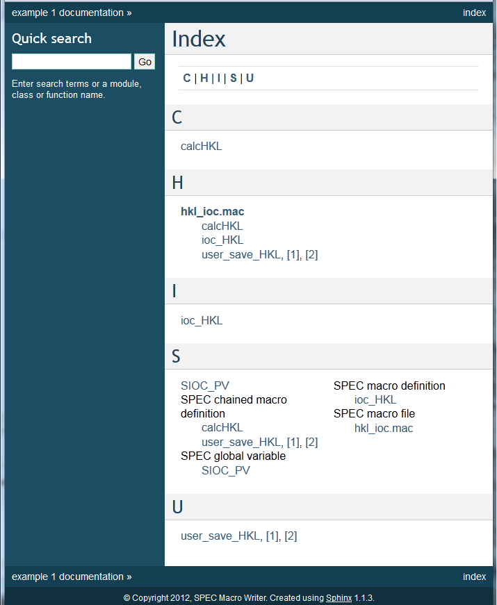

.. $Id$

==========================================================
How to Markup a SPEC Macro File
==========================================================

#. start with SPEC macro file that is not marked up
#. create a Sphinx documentation project
#. apply markup
#. test

.. tip:: In addition to the Sphinx documentation (http://sphinx.pocoo.org),
	a good reference how to document your macros can be found here: 
	http://stackoverflow.com/questions/4547849/good-examples-of-python-docstrings-for-sphinx 
	but a Google search for *sphinx python docstrings examples* will turn up a wealth of alternatives.

Basic SPEC Macro file
==============================

This example is a SPEC macro file from the APS subversion repository:
https://subversion.xor.aps.anl.gov/spec/macros/trunk/common/hkl_ioc.mac
because it is simple, brief, does not contain references to other
macro files, provides its documentation in SPEC comments, and has not been
marked up previously for documentation with Sphinx.  Here is the file 
*hkl_ioc.mac* in its entirety.

.. literalinclude:: ../markup_example/hkl_ioc.mac.original
    :tab-width: 4
    :linenos:
    :language: guess

Create a Sphinx Project
==============================

.. index:: in-source configuration
.. tip:: Use an :ref:`in-source configuration`

Make a project directory and change directory into it.  
(On my development system, this directory is called ``../markup_example``.)
Copy the file above into this directory with the name *hkl_ioc.mac*.
Then run::

	sphinx-quickstart

Take most of the defaults.  
These are the non-defaults for the example project:

========================================================================================  ================================
prompt                                                                                    response
========================================================================================  ================================
``> Project name:``                                                                       *example*
``> Author name(s):``                                                                     *SPEC Macro Writer*
``> Project version:``                                                                    *1*
``> autodoc: automatically insert docstrings from modules (y/N) [n]:``                    *y*
``> viewcode: include links to the source code of documented Python objects (y/N) [n]:``  *y*
========================================================================================  ================================

Edit the document ``index.rst`` so it looks like this::

	.. example documentation master file, created by
	   sphinx-quickstart on Sun Jul 15 17:54:46 2012.
	   You can adapt this file completely to your liking, but it should at least
	   contain the root `toctree` directive.
	
	Welcome to example's documentation!
	===================================
	
	.. autospecmacro:: hkl_ioc.mac
	
	Contents:
	
	.. toctree::
	   :maxdepth: 2
	
	
	
	Indices and tables
	==================
	
	* :ref:`genindex`
	* :ref:`modindex`
	* :ref:`search`
	
Edit *conf.py* and make these changes:

===================================================   ==============================
change                                                directions
===================================================   ==============================
``sys.path.insert(0, os.path.abspath('..'))``         *replace* line 19
``extensions.append( 'sphinxcontrib.specdomain' )``   insert *after* line 28
===================================================   ==============================

The revised file should look like this file: :download:`../markup_example/conf.py`.

Now, build the documentation by typing::

    make html
    firefox _build/html/index.html &

You should expect a page that looks like this figure:

    Documentation of the original **hkl_ioc.mac** file.

Apply Markup
==============================

.. tip:: We will edit the *hkl_ioc.mac* file now.
	Before we start applying markup,
	it's a good idea to make a backup copy of the original::
	
		cp hkl_ioc.mac  hkl_ioc.mac.original

Here are the steps to consider when converting SPEC comments to reST markup.

#. identify the SPEC comments
#. extended comments (docstrings)
   #. global docstring
   #. macro docstring
   #. others are ignored by Sphinx
#. descriptive comments

SPEC comments
------------------

Obvious as this sounds, it may help someone to see that the SPEC comments
are on lines 1-32.  It is easy to place this entire block within an 
extended comment [#]_ (known hereafter as a *docstring*).  Make these 
additions to lines 1 and 32:

=====  =============================================================================================
line   new
=====  =============================================================================================
1      ``"""#===============================================================================``
32     ``#==============================================================================="""``
=====  =============================================================================================

But this is not enough, as the content will look like a wreck.

--------------------------

	#===============================================================================
	#**************SPEC macros for the Advanced Photon Source***********************
	#===============================================================================
	#
	# Beamline/Sector: 4ID
	# 
	# Macro Package: hkl_ioc.mac
	#
	# Version: 1.0 (August,2005)
	#

--------------------------

... and so forth

So, there is a choice to make.  Either:

#. format the comment as literal text (least work)
#. reformat the as reST. (more work, looks better)

Literal text
++++++++++++

To format a SPEC comment as literal text, consider this brief SPEC comment: 

.. code-block:: guess
	:linenos:
	
	# Summary: This macro scans the sample in a circular mesh.
	# 
	# Dependencies: It is part of the circular mesh macro package.

Its literal text rendition in reST is written:

.. code-block:: guess
	:linenos:
	
	"""
	::
	
		# Summary: This macro scans the sample in a circular mesh.
		# 
		# Dependencies: It is part of the circular mesh macro package.
		
	"""

which looks like:

-------------------
	
	::
	
		# Summary: This macro scans the sample in a circular mesh.
		# 
		# Dependencies: It is part of the circular mesh macro package.

-------------------

Note that the two colons indicate literal text follows.  
Both the blank line after the colons and the final blank line are required to avoid warnings.
And, the entire comment *must be indented* at least one column to the right of the two colons.

reST markup
+++++++++++++

In reST, the SPEC comment above might be written as two definition list items [#]_:

.. code-block:: guess
	:linenos:
	
	"""
	Summary
	    This macro scans the sample in a circular mesh.
	 
	Dependencies
	    It is part of the circular mesh macro package.
    
	"""

which looks like:

-------------------

	Summary
	    This macro scans the sample in a circular mesh.
	 
	Dependencies
	    It is part of the circular mesh macro package.

-------------------

(The final blank line is necessary to avoid warnings.)

This markup does not look too complicated until we reach the *Modification history* 
starting at line 23.  The content here might be coded as either literal text (above)
or a reST table.  Since the table is easy *and* CVS is no longer used to build the 
revision history, we'll format it as a table.

Consider this SPEC comment:

.. code-block:: guess
	:linenos:
	
	#Revision 1.3  2006/05/22 20:34:35  jiaox
	#removed unsed lines in ioc_HKL.
	#
	#Revision 1.2  2006/05/11 17:46:31  jiaox
	#Added CVS Log entry.
	
It might be put into a table [#]_ such as:

.. code-block:: guess
	:linenos:
	
	========   ===================  =======  =====================================
	Revision   date/time            author   remarks
	========   ===================  =======  =====================================
	1.3        2006/05/22 20:34:35  jiaox    removed unsed lines in ioc_HKL.
	1.2        2006/05/11 17:46:31  jiaox    Added CVS Log entry.
	========   ===================  =======  =====================================

which looks like:

-------------------

========   ===================  =======  =====================================
Revision   date/time            author   remarks
========   ===================  =======  =====================================
1.3        2006/05/22 20:34:35  jiaox    removed unsed lines in ioc_HKL.
1.2        2006/05/11 17:46:31  jiaox    Added CVS Log entry.
========   ===================  =======  =====================================

-------------------

Global Docstring
-------------------------

The convention is to treat the first docstring in a macro file as the *global docstring*.

With these ideas in mind,
here is the markup of the first 32 lines:

.. code-block:: guess
	:linenos:
	
	"""
	SPEC macros for the Advanced Photon Source
	
	Beamline/Sector
		4ID
	
	Macro Package
		hkl_ioc.mac
	
	Version
		1.0 (August,2005)
	
	Description
		A user defined calcHKL to write the current HKL postion to a
		soft IOC. It requires spec softioc running.
	
	Written by
		X. Jiao 08/08/2005
	 
	Modified by: 
	
	User macros
		ioc_HKL -> to turn on/off the feature of putting HKL to shared 
		memory.
	
	Internal macros
		ioc_put_HKL -> write HKL to the soft IOC
	
	Modification history:
	 
	========   ===================  =======  =====================================
	Revision   date/time            author   remarks
	========   ===================  =======  =====================================
	1.3        2006/05/22 20:34:35  jiaox    removed unsed lines in ioc_HKL.
	1.2        2006/05/11 17:46:31  jiaox    Added CVS Log entry.
	========   ===================  =======  =====================================
	"""

which (except for the section title which is hard to render in this document) looks like:

-------------------

Beamline/Sector
	4ID

Macro Package
	hkl_ioc.mac

Version
	1.0 (August,2005)

Description
	A user defined calcHKL to write the current HKL postion to a
	soft IOC. It requires spec softioc running.

Written by
	X. Jiao 08/08/2005
 
Modified by: 

User macros
	ioc_HKL -> to turn on/off the feature of putting HKL to shared
	memory.

Internal macros
	ioc_put_HKL -> write HKL to the soft IOC

Modification history:
 
========   ===================  =======  =====================================
Revision   date/time            author   remarks
========   ===================  =======  =====================================
1.3        2006/05/22 20:34:35  jiaox    removed unsed lines in ioc_HKL.
1.2        2006/05/11 17:46:31  jiaox    Added CVS Log entry.
========   ===================  =======  =====================================

-------------------

Test
-----------

Be sure to test your changes as you progress, until you are confident with reST markup.
The *make* process is efficient, only rebuilding the documentation from affected
.rst souce file changes.  Usually, this also considers changes in the .mac files.
This command is usually all it takes to rebuild the HTML documentation::

	make html

However, you might wish to make sure changes in the .mac files
cause documentation to be rebuilt.  It might be easier, although less efficient,
to rebuild your HTML documentation each time using this command::
	
	make clean html

The builds are usually very fast (seconds).

Docstring markup in each macro definition
--------------------------------------------- 

Each of the macro definitions can be marked up to provide documentation with the definition.
The convention is to supply a short one-line summary first, then additional information as appropriate.

Consider the definition for ``ioc_HKL``.  
A summary of it is given in the first comment section.
We'll apply that as the docstring:

.. code-block:: guess
	:linenos:

	def ioc_HKL '{ 
	    """to turn on/off the feature of putting HKL to shared memory."""
	     
	    if($# != 1) { eprint "Usage: ioc_HKL on/off ";exit}
	    
	    
	    if(("$1" == "on")) {
	       cdef("user_save_HKL","ioc_put_HKL","ioc_HKL","0x20")
	       print "Now put HKL to softioc."
	       exit
	    }
	    if(("$1" == "off")) {
	       cdef("user_save_HKL","","ioc_HKL","delete")
	       print "Stop put HKL to softioc."
	       exit
	    }
	    eprint "Usage: ioc_HKL on/off "
	}'

Do the same thing for the *ioc_put_HKL* macro definition.

Document the global variable
----------------------------------

On line 45 (in the original file), there is a global variable declaration: ``global SIOC_PV``.
The description for this variable has been deduced from its usage in this file with EPICS.  [#]_
It is possible to document :spec:global:`SIOC_PV` using a :ref:`descriptive comment`.
Insert the line containing ``global SIOC_PV`` with this one::

	global SIOC_PV             ;#: soft IOC PV name

The semicolon is used to ensure that the spec command is finished.  It might be unnecessary.
The descriptive comment can be used *in-line* to define the item on that line.

Similarly, add another :ref:`descriptive comment` to document line 38 (original file) by inserting this
line *before* the line that reads ``cdef("user_save_HKL","","ioc_HKL")``::

	#: preload check/setting here
	
Here the descriptive comment appearing on one line will provide a summary
for the item defined on the next line only.

Final Results
=================

Rebuild the completed :download:`../markup_example/hkl_ioc.mac` documentation with::

	make html

.. note:: Don't be concerned about the warnings of
	``SEVERE: Duplicate ID: "cdef-user_save_HKL".``
	These messages are only informative.  
	This :ref:`bug <bugs>` should be resolved in a future version of ``specdomain``.

After refreshing the page in the WWW browser, it should like this:

    Documentation of the marked-up **hkl_ioc.mac** file.

and the index will look like:

    Index of the marked-up **hkl_ioc.mac** file.

.. note::  It is :ref:`planned for the future <todo>` to provide options for sorting the output alphabetically
	and to provide other features.

-----------------

.. rubric:: Footnotes

.. [#] a SPEC :ref:`extended comment <spec-extended-comments>` is text that is surrounded by three 
       double-quote characters (``"""``), such as:
       
       		"""this triple-quoted text is a docstring"""
       
       In the Python language, this is known as a docstring.
       But, **unlike Python**, SPEC does not recognize single quotes
       to mark extended comments.  Only use the double quote character.
.. [#] definition list: http://docutils.sourceforge.net/docs/ref/rst/restructuredtext.html#definition-lists
.. [#] table: http://sphinx.pocoo.org/rest.html#tables
.. [#] EPICS: http://www.aps.anl.gov/epics
